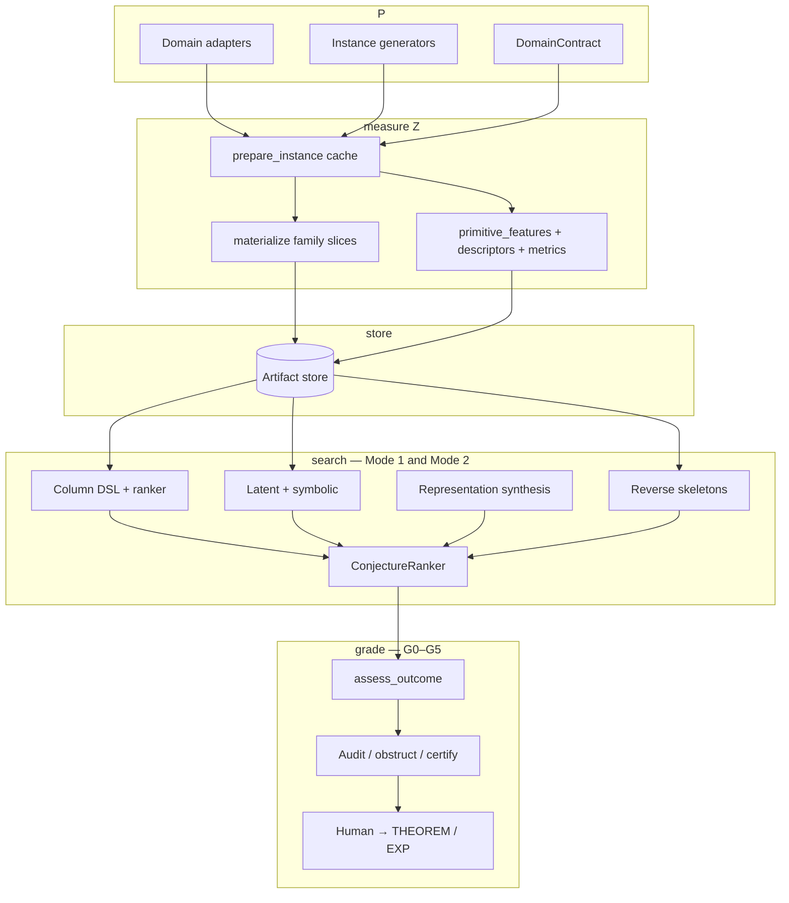

# RDE architecture (code pipeline)

Science vocabulary is **one stack**:

\[
P \;\longrightarrow\; Z \;\longrightarrow\; X \;\longrightarrow\; E \;\longrightarrow\; S \;\longrightarrow\; O
\]

Canonical definitions, two modes, outcome grades **G0–G5**, and reverse
validation **V1–V4** live in
[`methodology.md`](methodology.md).
This file maps that stack onto folders, worker hooks, and CLI. It is **not** a
second methodology. Do not invent parallel numbered ladders.

JSON writes `grade` / `g{k}_met` (`OutcomeAssessment.to_payload()`).
Folder layout is not a science stack.

---

## How the stack hits code

```text
  P              domain adapters, generators, DomainContract
    │
    ▼
  measure Z      prepare_instance → materialize + primitive_features
                 → descriptors / metrics
    │
    ▼
  store          durable feature tables (JSONL, NPZ, sealed Parquet)
    │
    ▼
  search         Mode 1: ranker / latent / symbolic / represent
                 Mode 2: synthesis skeletons (ALGO-057)
                          recovery extractors (ALGO-063; RecoveryDomain)
    │
    ▼
  grade          G0–G5, leak audit, certify / obstruct
```



| Code | Methodology | Primary locations |
|---|---|---|
| Domain adapters, generators, `DomainContract` | **P** | `src/rde_domains/`, `core/domain_contract.py`, `generators/` |
| `prepare_instance`, `materialize`, `primitive_features`, descriptors, metrics | Measure **Z** (later search may treat results as **X** / **E**); never derived from the hidden answer | `runtime/worker.py`, `features/`, `runtime/metrics.py` |
| JSONL / NPZ / Parquet | Persistence of those measurements | `io/store.py`, `runtime/campaign.py`, `io/seal.py` |
| `discover` / `latent` / `represent` / `synthesize` | Mode 1: \(Z/X/E/O\) hypotheses. Mode 2: skeletons under \(C_{\mathrm{target}}\) via `SynthesisDomain` (divide/combine) | `expression/`, `discovery/`, `analyze/ranker.py`, `synthesis/` |
| Query-tape extraction under a query budget | Mode 2's other executable surface (methodology §4): `RecoveryDomain` | `recovery/` |
| `assess_outcome`, audit / obstruct / certify | Grades G0–G5 | `analyze/outcome.py` |

**Cross-cutting:** compute backends (`backends/`) and campaign orchestration
(`runtime/campaign.py`). They add throughput, not letters.

### Instance cache contract

The worker (`runtime/worker.py`) calls `prepare_instance(instance, indices=…)`
**once** when the domain implements it, then passes that dict as `cache=` into
both `primitive_features` and `materialize`.

That is required whenever those two methods would otherwise recompute the same
expensive primitive (bounded-query sample, \(2^{n}\) landscape, \((N-1)!/2\)
tour costs, MST-gap groups). Cheap domains may omit it. Metrics must consume
the cache (e.g. `costs`) instead of re-enumerating.

`primitive_features()` must expose the **raw arrays** the forward catalog
needs (`D`, `diff_profile`, `costs`, …), not a handful of scalars derived from
one hand-authored mechanism. A domain that only returns three mechanism
scalars starves Mode 1.

### Two operating modes (same stack)

| Mode | CLI | Methodology |
|---|---|---|
| **Fill** | `run`, `campaign` | Populate **P**, measure **Z** into the store |
| **Search** | `discover`, `latent`, `discover-symbolic`, `represent`, `rank-*`, `synthesize` | Mode 1 hypotheses or Mode 2 skeletons |

Fill and search are separable: run an expensive campaign once, iterate discovery
on the same store.

Mode 1 search has three **hypothesis shapes** (not a waterfall):

| Shape | Typical grade |
|---|---|
| Column DSL + ranker | G1–G2 |
| Latent + symbolic | G2–G4 |
| Representation synthesis | G4–G5 |

Mode 2 compilation depth (TARGET → ALGORITHM → … → primitives) is methodology
§5. Code today covers TARGET + ALGORITHM + pre-domain recurrence pruning
([hierarchical-synthesis.md](hierarchical-synthesis.md)).

### Distinctions worth keeping

**Descriptors vs metrics** — both become columns, different scientific roles:

- **Descriptors** \(F\) — measurements of the object (spectral entropy, bounded-query collision rate, …).
- **Metrics** \(K\) — composite scores tied to [`QueryIntent`](../core/protocols.py)
  (evaluate, overlap, update, compress, rank). These are the discovery **targets**.

**Hard boundary:** domain-specific physics lives in external plugins, not
`src/rde/`. Core RDE never imports repository domain adapters
(`tests/rde/integration/test_no_qpfa_import.py` and
`test_no_rde_domains_import.py`).
\(S\) is domain-supplied; it is not Hilbert space unless that domain says so.

---

## Package layout

`src/rde/` is organized by **role**.

```text
src/rde/
├── __main__.py         # `python -m rde` entrypoint (delegates to cli/)
├── cli/                # Argument parsing + command implementations
│   ├── main.py         # entry function __main__.py calls
│   ├── commands.py     # one function per subcommand (run, discover, repr-rank, …)
│   └── common.py       # shared CLI plumbing
├── __init__.py         # Public Python API (re-exports below)
│
├── core/               # Types, registry, plugins, schema
│   ├── protocols.py    # Domain, Descriptor, Metric, QueryIntent, RecoveryDomain, SynthesisDomain
│   ├── instance.py     # InstanceRecord
│   ├── registry.py     # Plugin registry
│   ├── plugins.py      # build_registry(), domain loaders
│   ├── schema.py       # JSONL validation
│   ├── limits.py       # Brute-force N caps
│   ├── domain_contract.py
│   └── primitives.py   # float vs ndarray split
│
├── runtime/            # Execution pipeline
│   ├── pipeline.py     # run_pipeline()
│   ├── config.py       # ResourceLimits, StageProfiler
│   ├── worker.py       # Per-instance worker (picklable)
│   ├── campaign.py     # Multi-size batch runs
│   ├── instance_descriptors.py
│   ├── metrics.py      # Composite metrics
│   └── targets.py      # Default discovery targets per domain
│
├── io/                 # Persistence
│   └── store.py        # JSONL ledger + NPZ sidecars
│
├── analyze/            # After a run: tables, correlations, ranker
│   ├── query.py
│   ├── tables.py
│   ├── ranker.py       # ConjectureRanker
│   ├── calibration.py
│   └── outcome.py      # G0–G5 gates
│
├── experiment/         # Mechanical enforcement: gate + receipt + run merging
│   ├── gate.py         # ExperimentGate, phase/receipt validation
│   ├── merge.py        # leak-clean discovery run merging
│   ├── runner.py
│   └── stages.py
│
├── features/           # Descriptor implementations
├── descriptor_gen/      # Parameterized descriptor generators (enumerate/rank templates)
├── backends/           # numpy / mlx / torch enumeration
├── generators/         # Instance family plugins
├── expression/         # Metric DSL + mlx/torch eval
├── discovery/          # Latent, symbolic, GP, operator, diversity archive
├── synthesis/          # Mode 2 (ALGO-057)
├── recovery/           # Mode 2 query-tape recovery (HSP-shaped surface, see methodology §4)
├── representation/     # Representation Core (experimental, see below)
├── search/             # Generic verify/holdout-rank search engine (see below)
├── substrate/          # Opt-in ontology-free program substrate (see below)
├── testing/            # toy domains + store stress helpers
│
└── docs/               # This file, CLI README, implementation status
```

### Cross-cutting search infrastructure

Like `backends/`, these add search throughput/reach, not new science
letters — they never appear in a PZXESO status claim.

- `search/` names the enumerate→verify-on-train→drop→verify-on-holdout→
  drop→rank-by-holdout shape that `representation/program_search.py` and
  `recovery/search_space.py` each independently implemented for different
  candidate types (typed representation chains; recovery-protocol chains).
  `search_with_holdout()` is that shape once, parameterized by a
  caller-supplied `Verifier`/`candidate_id`; both modules now delegate to it
  internally.
- `discovery/archive.py`'s `EliteArchive` is a MAP-Elites-style diversity
  archive (best candidate per behavior-descriptor bucket), complementing
  `representation/pareto.py`'s dominance frontier — a home for multiple
  non-dominated witnesses that occupy different behavioral niches, not a
  replacement for Pareto ranking.
- `substrate/` is a deliberately minimal, opt-in alternative candidate
  source: a tiny deterministic bytecode VM (`vm.py`) plus bounded brute-force
  program enumeration (`enumeration.py`), with no attached mathematical
  vocabulary. It plugs into the same `search.search_with_holdout` engine as
  the typed-grammar enumerators — an interchangeable candidate space chosen
  at call time, not a replacement for typed-grammar search. See
  `rde/testing/vm_toy.py` for an end-to-end demonstration and each module's
  docstring for why it does not aim to scale past small instruction counts.

### Representation Core (experimental)

`representation/` formalizes a representation of an object as a first-class
artifact — `Object`, `Representation` (carrier + encode/decode + optional
distance/complexity), `Transformation` (an edge between two representations
of the same object type), `EquivalenceResult`, and `Certificate` — separate
from the P/Z/X/E/S/O pipeline above. It exists so a representation's
roundtrip claim (`decode(encode(x)) == x`) can be stated and certified
without conflating "encoding" with "feature extraction."

Phase 1 shipped the primitive types and a single numerical-roundtrip
equivalence check, exercised against generic reference representations
(vector/matrix/polynomial) in `tests/rde/representation/`. Phase 2 added
`RepresentationGraph`: representations as nodes, `Transformation`s as costed
edges, cheapest-path search (`find_path`), multi-hop composition
(`TransformationPath`), and pairwise certificate comparison (`compare`).

Phases 3-6 (`array_backend.py`, `grammar.py`, `search.py`, `symbolic.py`,
`pareto.py`, `operator.py`) added:

- a dual-backend (NumPy always, MLX on Apple Silicon) batched numeric
  kernel layer, mirroring `rde.backends`' `NumpyBackend`/`MlxBackend` split;
- a fixed six-primitive representation grammar (identity, matrix reshape,
  compact/full DFT, first-difference, sorted+permutation,
  polynomial-in-a-fixed-basis) and exhaustive complexity ranking against a
  batch of sample data — deliberately exhaustive, not beam/evolutionary
  search, because six primitives makes a heuristic search algorithm
  complexity for its own sake (see `search.py`);
- `FormalCertificate` (SymPy exact-rational `proved`/`disproved`), kept
  textually distinct from the numeric `Certificate`
  (`verified`/`refuted`) so the two are never conflated;
- vectorized Pareto dominance/frontier ranking over representation
  objectives, with no default single-number Q(R) scalarization (an
  explicit opt-in one is offered — see `pareto.py` for why an implicit one
  would encode arbitrary weights as if they were discovered);
- operator transport (`E_R @ U @ D_R`) and `off_diagonal_energy`,
  reproducing the textbook fact that the full complex DFT diagonalizes
  circulant operators using the grammar's own `dft_full` primitive
  (verified numerically, not asserted — see `tests/rde/representation/test_operator.py`).

Phase 7 ("open discovery" — an object through the whole O/R/S/A/C pipeline)
is exercised as an integration test
(`tests/rde/representation/test_open_discovery_integration.py`) composing
Phases 1-6 as they already exist, not as new library code.

A follow-up audit against the original proposal (prompted by "is this
100% implemented" — it wasn't) closed several real gaps: `cost.py`
(conversion cost as a genuine third Pareto objective), `equivalence_types.py`
(typed equivalence beyond numeric roundtrip — this also found and fixed a
latent unsoundness in probing `dft`'s decode side), `operator_discovery.py`
(recovering an *unknown* operator from samples, not just transporting a
known one), `structure.py` (a small checkable structure vocabulary),
`holdout.py` (an anti-cheating audit over a genuinely withheld primitive
subset), `report.py` + `cli/commands.py`'s `rde repr-rank` (a durable
report and a CLI surface), and domain-side integration
(`rde_domains/hsp_functions/representations.py`,
`rde_domains/tsp/representations.py` — outside this package, since core
must not import domain plugins) running the grammar/search machinery on
real hsp_functions/TSP data. Core still ships no domain-specific
representations of its own — same core/domain boundary as everywhere else
in this file.

A second pass (prompted by "let's take more iterations to full scope")
closed the rest of what that audit had flagged as missing, except one
item left deliberately open: `rde repr-rank-run` reads an array field a
real `run`/`campaign` already stored (`Store`) and ranks it, writing back
through a new `Store.append_representation_report` — pipeline wiring and
full persistence, verified not to modify `run`/`campaign`'s own output.
What is still NOT done, on purpose: touching `hsp_functions/domain.py`'s
`primitive_features()` to add representation-complexity as a real Mode 1
predictor descriptor and running it through
`correlate_with_target`/`assess_outcome`'s G0-G5 gates — a larger change
than a gap-closure pass should make without explicit sign-off.
`hsp_functions/preregistered_experiment.py` is the
honest substitute: a standalone preregistered statistical check, run once,
reporting its actual (mixed) result rather than a curated one.
Canonicalization and search *over new representations* (as opposed to
ranking the fixed grammar) remain unimplemented — these are open-ended
program-synthesis problems, not bounded tasks; see
`rde/representation/__init__.py` for the current, maintained scope
statement.

Engineering chronology (what shipped when): [`roadmap.md`](roadmap.md).

## Import conventions

Prefer subpackage imports in new code:

```python
from rde.core import InstanceRecord, build_registry
from rde.runtime import RunConfig, run_pipeline
from rde.io import Store
from rde.analyze import flatten_features, ConjectureRanker
```

The top-level `rde` package re-exports the common surface from `rde/__init__.py`.
