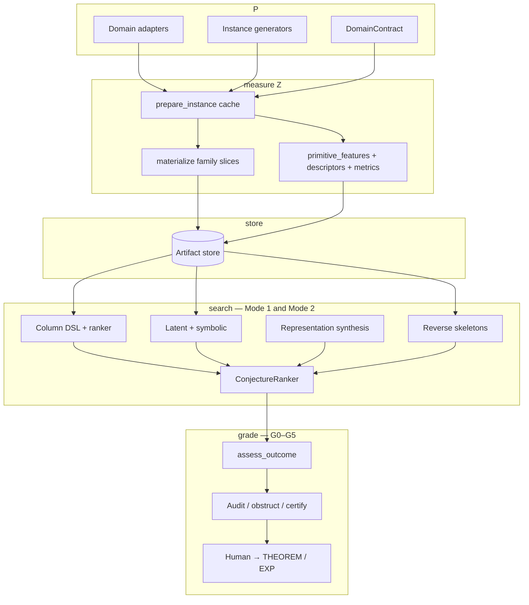

# RDE architecture (code pipeline)

Science vocabulary is **one stack**:

\[
P \;\longrightarrow\; Z \;\longrightarrow\; X \;\longrightarrow\; E \;\longrightarrow\; S \;\longrightarrow\; O
\]

Canonical definitions, two modes, outcome grades **G0–G5**, and reverse
validation **V1–V4** live in
[`methodology.md`](methodology.md).
This file maps that stack onto folders, worker hooks, and CLI. It is **not** a
second methodology. Do not invent parallel numbered ladders.

JSON writes `grade` / `g{k}_met` (`OutcomeAssessment.to_payload()`).
Folder layout is not a science stack.

---

## How the stack hits code

```text
  P              domain adapters, generators, DomainContract
    │
    ▼
  measure Z      prepare_instance → materialize + primitive_features
                 → descriptors / metrics
    │
    ▼
  store          durable feature tables (JSONL, NPZ, sealed Parquet)
    │
    ▼
  search         Mode 1: ranker / latent / symbolic / represent
                 Mode 2: synthesis skeletons (ALGO-057)
                          recovery extractors (ALGO-063; RecoveryDomain)
    │
    ▼
  grade          G0–G5, leak audit, certify / obstruct
```



| Code | Methodology | Primary locations |
|---|---|---|
| Domain adapters, generators, `DomainContract` | **P** | `src/rde_domains/`, `core/domain_contract.py`, `generators/` |
| `prepare_instance`, `materialize`, `primitive_features`, descriptors, metrics | Measure **Z** (later search may treat results as **X** / **E**); never derived from the hidden answer | `runtime/worker.py`, `features/`, `runtime/metrics.py` |
| JSONL / NPZ / Parquet | Persistence of those measurements | `io/store.py`, `runtime/campaign.py`, `io/seal.py` |
| `discover` / `latent` / `represent` / `synthesize` | Mode 1: \(Z/X/E/O\) hypotheses. Mode 2: skeletons under \(C_{\mathrm{target}}\) | `expression/`, `discovery/`, `analyze/ranker.py`, `synthesis/` |
| `assess_outcome`, audit / obstruct / certify | Grades G0–G5 | `analyze/outcome.py` |

**Cross-cutting:** compute backends (`backends/`) and campaign orchestration
(`runtime/campaign.py`). They add throughput, not letters.

### Instance cache contract

The worker (`runtime/worker.py`) calls `prepare_instance(instance, indices=…)`
**once** when the domain implements it, then passes that dict as `cache=` into
both `primitive_features` and `materialize`.

That is required whenever those two methods would otherwise recompute the same
expensive primitive (bounded-query sample, \(2^{n}\) landscape, \((N-1)!/2\)
tour costs, MST-gap groups). Cheap domains may omit it. Metrics must consume
the cache (e.g. `costs`) instead of re-enumerating.

`primitive_features()` must expose the **raw arrays** the forward catalog
needs (`D`, `diff_profile`, `costs`, …), not a handful of scalars derived from
one hand-authored mechanism. A domain that only returns three mechanism
scalars starves Mode 1 (the Direction E TSP incident).

### Two operating modes (same stack)

| Mode | CLI | Methodology |
|---|---|---|
| **Fill** | `run`, `campaign`, `science-ledger` | Populate **P**, measure **Z** into the store |
| **Search** | `discover`, `latent`, `discover-symbolic`, `represent`, `rank-*`, `synthesize` | Mode 1 hypotheses or Mode 2 skeletons |

Fill and search are separable: run an expensive campaign once, iterate discovery
on the same store.

Mode 1 search has three **hypothesis shapes** (not a waterfall):

| Shape | Typical grade |
|---|---|
| Column DSL + ranker | G1–G2 |
| Latent + symbolic | G2–G4 |
| Representation synthesis | G4–G5 |

Mode 2 compilation depth (TARGET → ALGORITHM → … → primitives) is methodology
§5. Code today covers TARGET + ALGORITHM + pre-domain recurrence pruning
([hierarchical-synthesis.md](hierarchical-synthesis.md)).

### Distinctions worth keeping

**Descriptors vs metrics** — both become columns, different scientific roles:

- **Descriptors** \(F\) — measurements of the object (spectral entropy, bounded-query collision rate, …).
- **Metrics** \(K\) — composite scores tied to [`QueryIntent`](../core/protocols.py)
  (evaluate, overlap, update, compress, rank). These are the discovery **targets**.

**Hard boundary:** domain-specific physics lives in external plugins, not
`src/rde/`. Core RDE never imports repository domain adapters
(`tests/rde/integration/test_no_qpfa_import.py` and
`test_no_rde_domains_import.py`).
\(S\) is domain-supplied; it is not Hilbert space unless that domain says so.

---

## Package layout

`src/rde/` is organized by **role**.

```text
src/rde/
├── cli.py              # `python -m rde` entrypoint
├── __init__.py         # Public Python API (re-exports below)
│
├── core/               # Types, registry, plugins, schema
│   ├── protocols.py    # Domain, Descriptor, Metric, QueryIntent
│   ├── instance.py     # InstanceRecord
│   ├── registry.py     # Plugin registry
│   ├── plugins.py      # build_registry(), domain loaders
│   ├── schema.py       # JSONL validation
│   ├── limits.py       # Brute-force N caps
│   ├── domain_contract.py
│   └── primitives.py   # float vs ndarray split
│
├── runtime/            # Execution pipeline
│   ├── pipeline.py     # run_pipeline()
│   ├── config.py       # ResourceLimits, StageProfiler
│   ├── worker.py       # Per-instance worker (picklable)
│   ├── campaign.py     # Multi-size batch runs
│   ├── instance_descriptors.py
│   ├── metrics.py      # Composite metrics
│   └── targets.py      # Default discovery targets per domain
│
├── io/                 # Persistence
│   └── store.py        # JSONL ledger + NPZ sidecars
│
├── analyze/            # After a run: tables, correlations, ranker
│   ├── query.py
│   ├── tables.py
│   ├── ranker.py       # ConjectureRanker
│   ├── calibration.py
│   └── outcome.py      # G0–G5 gates
│
├── features/           # Descriptor implementations
├── backends/           # numpy / mlx / torch enumeration
├── generators/         # Instance family plugins
├── expression/         # Metric DSL + mlx/torch eval
├── discovery/          # Latent, symbolic, GP, operator
├── synthesis/          # Mode 2 (ALGO-057)
├── testing/            # toy domains + store stress helpers
│
└── docs/               # This file, CLI README, implementation status
```

Engineering chronology (what shipped when): [`roadmap.md`](roadmap.md).

## Import conventions

Prefer subpackage imports in new code:

```python
from rde.core import InstanceRecord, build_registry
from rde.runtime import RunConfig, run_pipeline
from rde.io import Store
from rde.analyze import flatten_features, ConjectureRanker
```

The top-level `rde` package re-exports the common surface from `rde/__init__.py`.
